# CVNext组会旁听记录

Oct 10

[toc]

> Notice: This is for personal recording, the work is protected by Lab

## Pre

- 横向内容有经费补贴
- discord 论文分享 （ @彼此的方式 ）
- 文浩，晟宇
- Co-work based on WeChat & Discord

## Cross MOT

> 郝圣禹 学长 - 白衣服

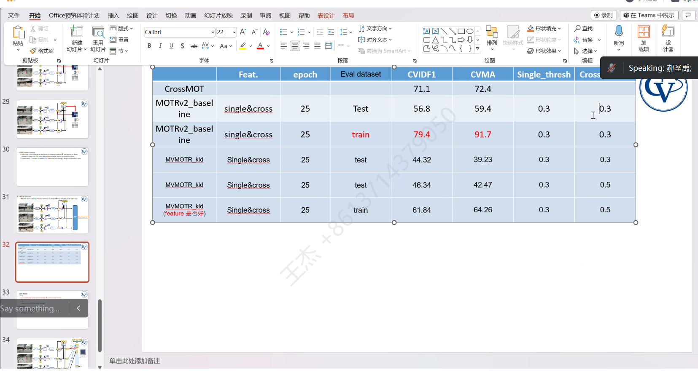

- 结构上更好 transformer based MOT
- 一体化的目的 -> 提升性能

## 视频理解

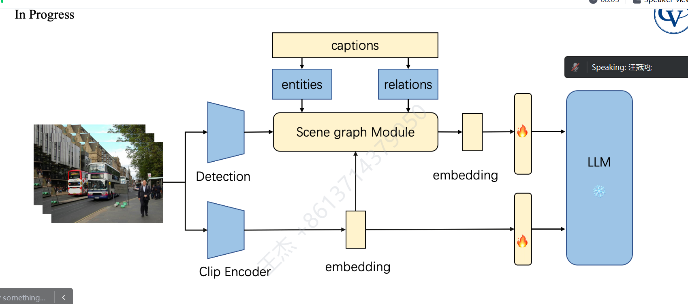

NLTK tool 

NLP 工具提取

**Video caption: 更准确的描述** 

> SCENE graph 的关系比较难捕捉？

A: Sense的模块，拿过来用

## 3D 渲染？

SKIP

> UCSD: Consistent-1-to-3: Consistent Image to 3D View Synthesis via Geometry-aware Diffusion Models

## AGENT

> 赵中涵 学长

STEVE BOT 

> [2306.00937.pdf (arxiv.org)](https://arxiv.org/pdf/2306.00937.pdf)

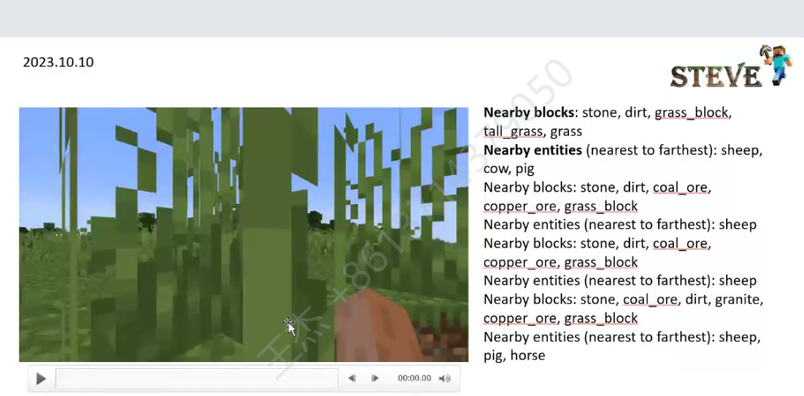

数学推理很难

-> MC 的脚本 解决任务

减少分割的麻烦

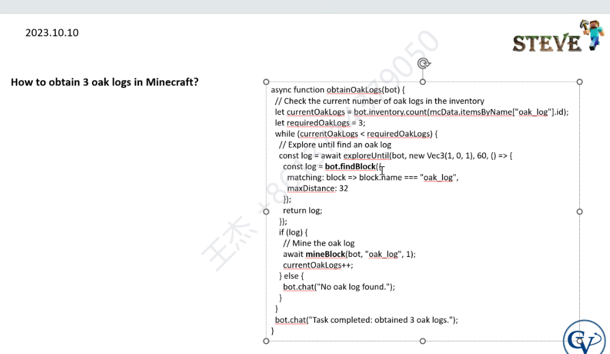

### Thinking : L

Llama 

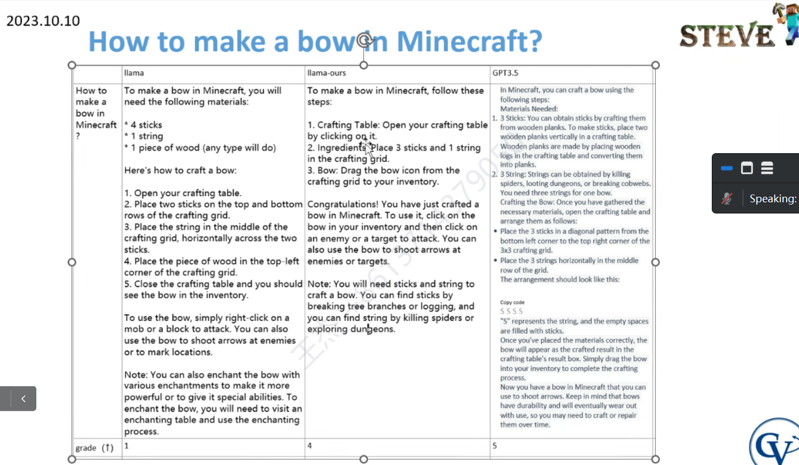

### 多分类任务

- 不要用交叉熵，尽量用sigmoid 

- 本科生数据采集 （玩，搭建环境）

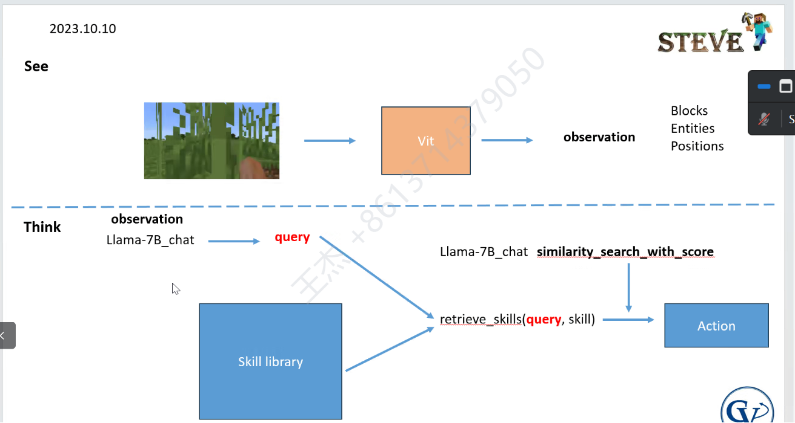

## 数据集

- 标准的

- Frame - text 对齐

- 场景丰富一些
- 单帧分类？ -> 超广角or ?

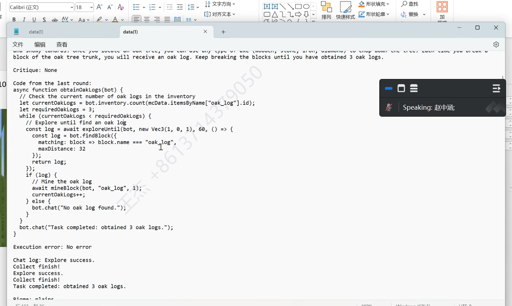

## 评价指标

- 完成任务的时间，效率，stack 数量

- 探索 广度

录好视频 vs 接到游戏？

智能体

- 不直接生成code
- 执行指令
- code DATA BASE

Obj: 做到视觉的实时推理，同时用Llama 

性能可能比不上voyager, 怎么比较，对比实验的setting

> CWH: LLM做high-level的planning，视觉部分需要接到另一个负责具体动作的小脑，已经设计好了

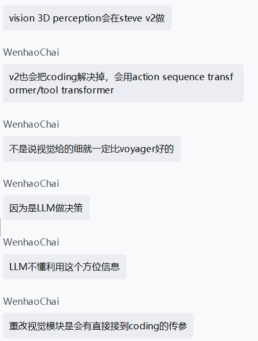

## Diffusion

不太懂

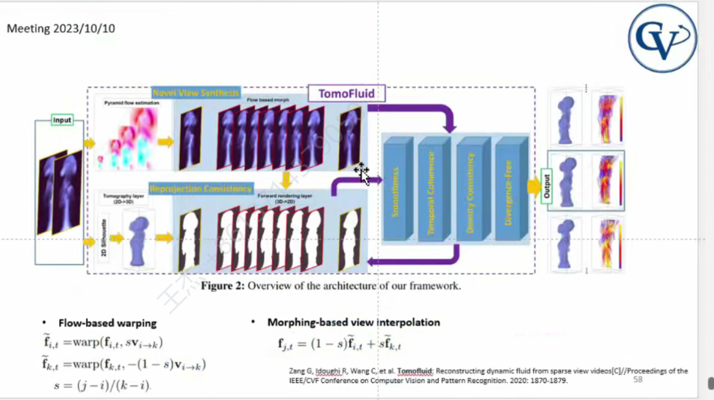

卡尔曼滤波器，显式求解

warping 先验信息求解	

## 医疗CT M多模态

> chen lu 学姐

medical diffusion? 

目标： CVPR 2023 11. 10 一个月

- 做了大量实验，更有机会

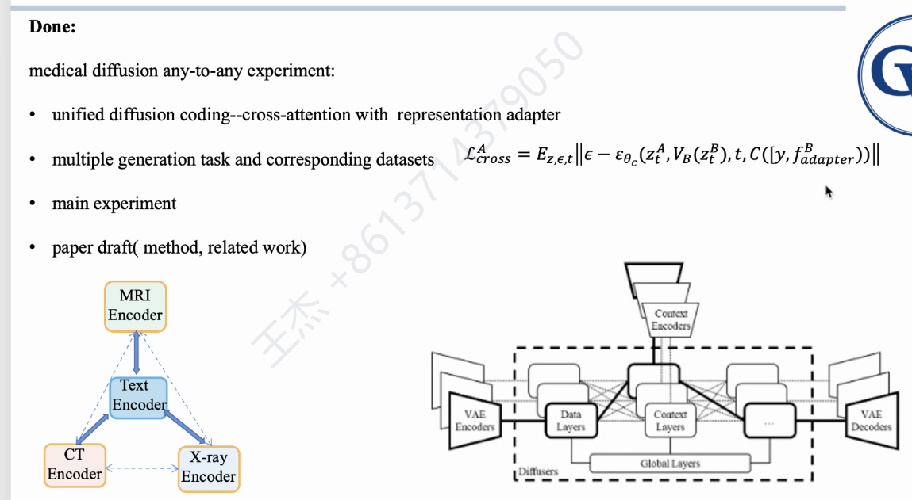

## Vision RL 

> Cao shidong 学长

- 引入Segmentation
- Transfer RL

明年做

### Active Vision

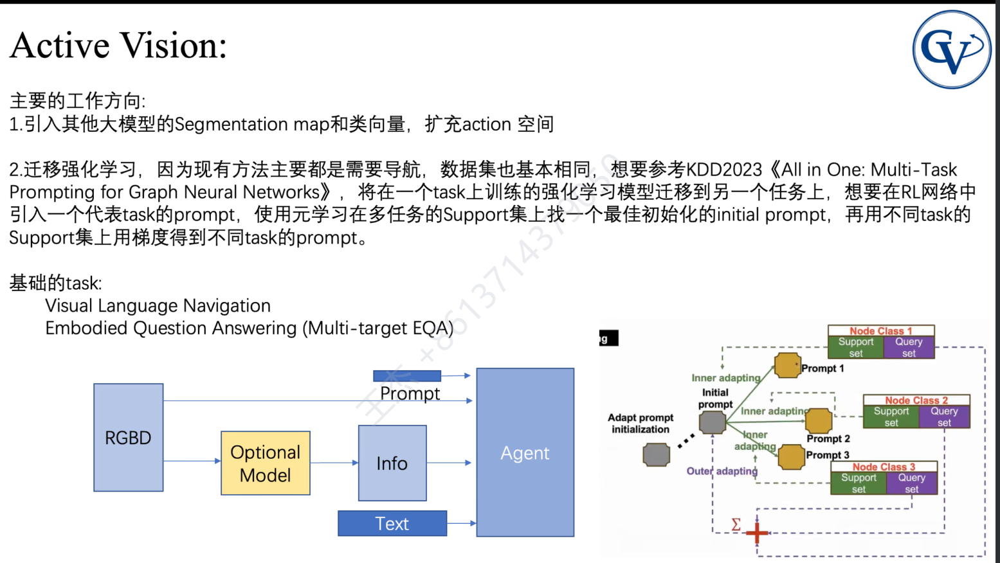

### 多模态嘲讽检测

> 主导，目前主要任务，jianshu学长辅助

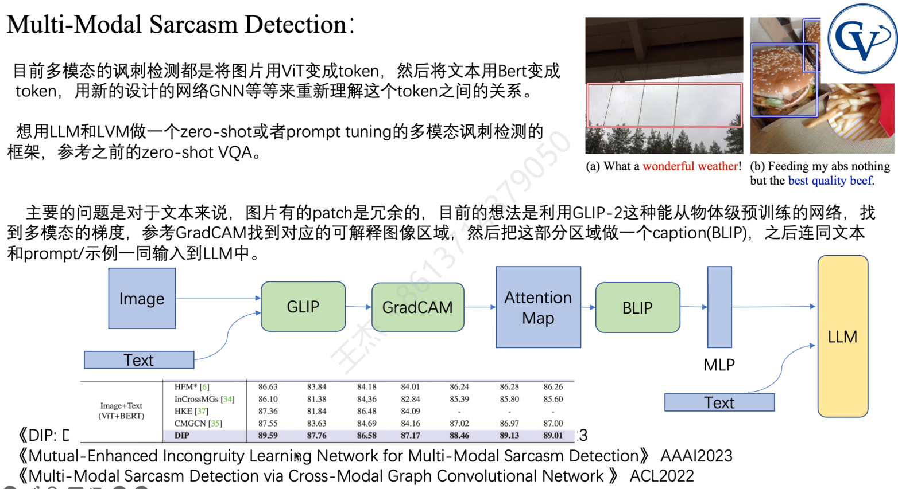

- 把图转换为VECTOR, 做LLM 或LVLM 的Input

- Base line DIP 有问题
- 希望抢用VGPT 做的东西 **从发论文的角度出发**

- 可以适用于公司的审核方面 （检查高级黑）
- 导师不太支持

> novalty 和应用？ 力大砖飞

现有model 过拟合特别严重，不够convincing 

## GIF生成

> 郭建树学长

- 现在的模型效果非常烂

- 连续帧，官方Demo 为 8frames 

- 收集了 2000 个 text - gif pair

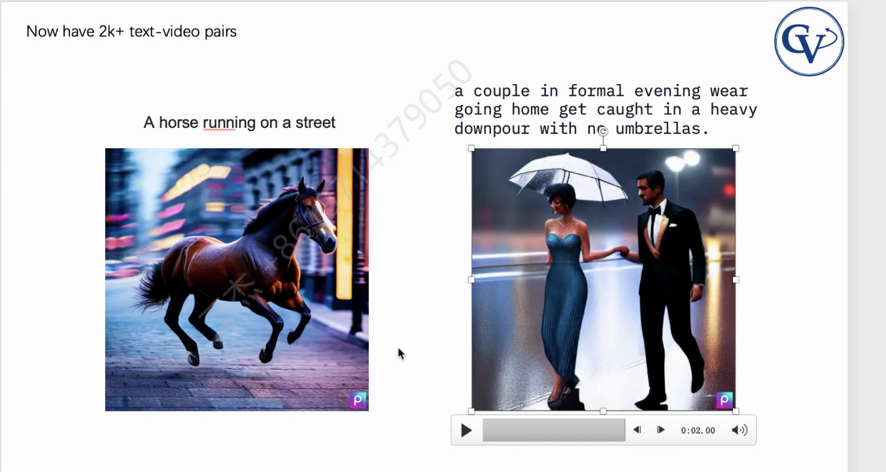

### 如何评估视频复杂度

- 打乱帧？
- 帧的
  - 光流的方法判断帧 是最basic
- 没有一个很好的metric ，文章水度比较高

## YOLO 背面检查

这东西居然还能用来做Pose 

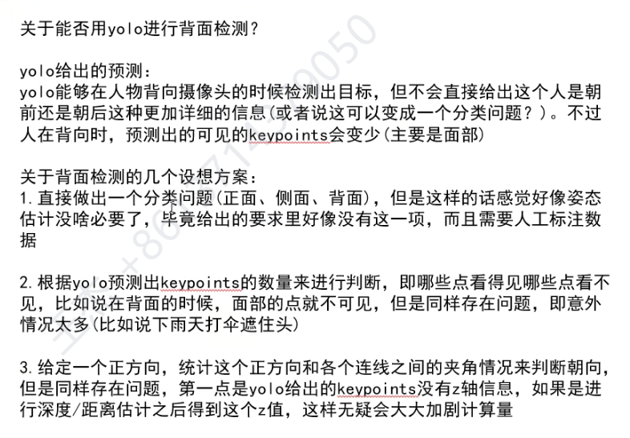

## 哨兵算法开发

> suchang

似乎是一个横向？

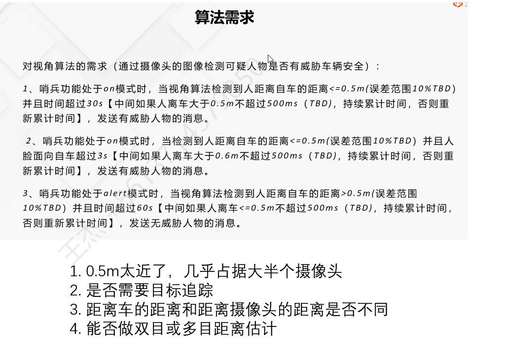

- DPT 做一个数据对齐

- 拍到地面 -> 投影估算

车凌科技

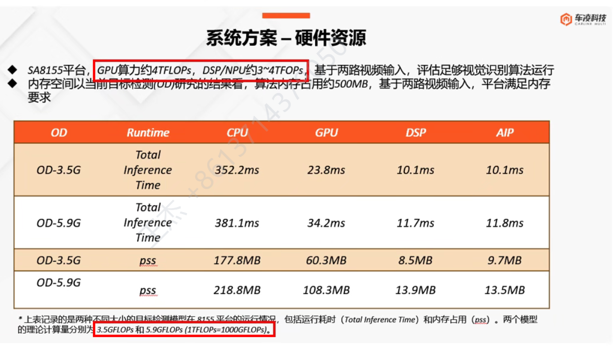

## MovieChat

> Song Enxin

感觉是很扎实的工作，排版很好看，不知道能不能找overleaf 看看类似排版

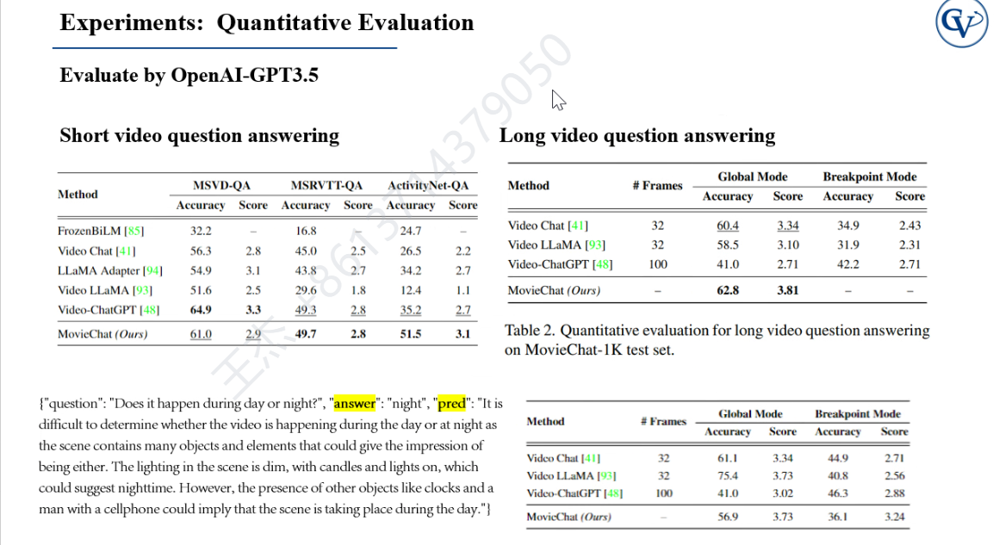

## MUSE

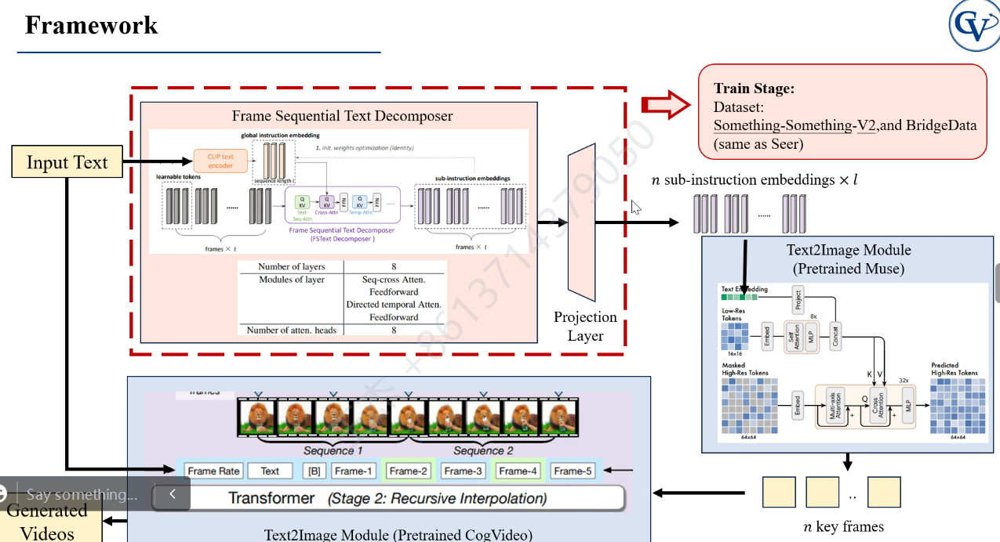

## 地图生成

Inpending & Rendering

>  dengjie

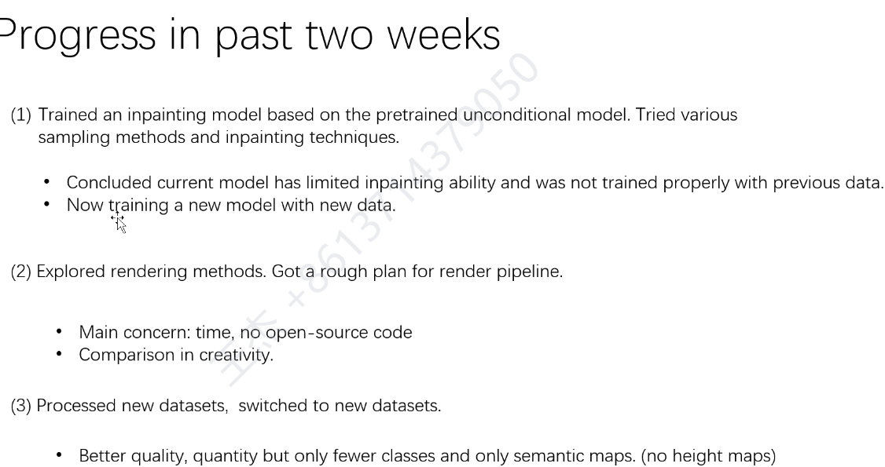